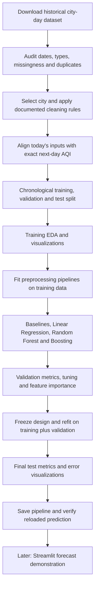

# AI-Based Next-Day Air Quality Index Prediction

**AI for Engineers mini-project | UCS321 | Project statement 8**
**Approach:** Build and validate the ML model first; add Streamlit afterward.
**Document date:** 7 October 2026

## 1. Objective and problem statement

Develop a supervised regression system that uses historical air-quality measurements to predict the next day's Air Quality Index (AQI). Compare Linear Regression, Random Forest, and XGBoost or Gradient Boosting, measure their errors, and explain which inputs help the predictions.

The uploaded `MST mini Project statements (1).pdf`, page 2, describes a BASF SE environmental-monitoring scenario involving urban and industrial air quality. Statement 8 explicitly asks for **future AQI values**. This project is an academic implementation of that scenario, with public data rather than company data.

**Prediction contract:** After the complete daily measurements for day `t` are available, predict AQI for calendar day `t + 1` in the same city. This is an offline next-day forecasting experiment. It assumes daily data are available at the forecast time; a live system would need to verify actual publication delays.

Predicting today's AQI from today's pollutants can be a learning exercise, but it is same-day estimation and does not meet the future-prediction objective on its own. AQI is derived from pollutant concentrations, so same-day estimation can also appear deceptively easy.

### What the assignment requires

The source statement permits public datasets, flexible feature selection, and freely chosen evaluation parameters. It explicitly requires a flow diagram with preprocessing and visualization documented.

| Assessment component | Marks | Evidence to prepare |
|---|---:|---|
| Problem understanding and objective clarity | 5 | Forecast horizon, inputs, target, intended use, limitations |
| Data collection and preprocessing | 10 | Dataset provenance, missingness audit, cleaning log, leakage-safe preparation |
| Model development and implementation | 12 | Reproducible pipelines, three models, tuning experiments |
| Performance evaluation and interpretation | 8 | Baselines, MAE/RMSE/R², error plots, feature importance |
| Innovation or creativity | 5 | One justified extension, such as a feature-ablation study or historical forecast explorer |
| Presentation/viva | 20 | Explain the workflow and demonstrate a saved-model prediction |

The project rubric totals 40 marks, with 20 additional marks for presentation/viva; the stated group size is 4–5. No particular score or model performance is guaranteed.

## 2. Recommended dataset

**Use [Air Quality Data in India (2015–2020), published by Rohan Rao on Kaggle](https://www.kaggle.com/datasets/rohanrao/air-quality-data-in-india). Start with `city_day.csv`.**

The public Kaggle page and its 2015–2020 title were verified on the web. Its full data card and CSV preview were inaccessible during this check, so the file/schema below are the expected starting point, not a freshly audited download. Verify the current files, source attribution, license, and columns after downloading. Treat the Kaggle copy as a community-published dataset, not a government-issued forecast product.

### Download and initial scope

1. Open the linked dataset page and download its files; Kaggle may require sign-in.
2. Extract `city_day.csv` into `data/raw/` and preserve it unchanged.
3. Record the downloaded version/date, license shown on the dataset page, file hash, columns, date range, city names, and row count.
4. Start with **one city, preferably Delhi**, after confirming its usable coverage in your downloaded file. This keeps the first model and viva explanation manageable.
5. Extend to multiple cities only after the single-city experiment works.

**Weather scope:** Temperature and humidity are not part of the expected city-day schema. Confirm this in your download; do not fabricate them. The assignment allows feature selection according to scope, so begin with the measured pollutants. A later extension can merge real weather observations by city and date, with source and units documented. Tomorrow's observed weather must never become an input to a forecast issued today.

The dataset is historical. It supports model development and a replay demo, but does not establish performance on present-day air quality. Verify missing values, units, suspicious readings, and coverage in the downloaded CSV before training; metadata verification is not a data-quality audit.

## 3. Feature and target schema

The table is the proposed model schema, based on the expected CSV fields plus derived forecast fields. Check it against the downloaded columns. Retain the source units; confirm them from dataset/source documentation before adding unit labels or combining sources. AQI is an index, not a pollutant concentration.

| Field | Type | Use in the first model |
|---|---|---|
| `City` | Text | Filter to the selected city; retain for traceability |
| `Date` | Date | Measurement day `t`; alignment, split, and plots |
| `PM2.5`, `PM10` | Numeric | Today's particulate measurements |
| `NO2`, `SO2`, `CO`, `O3` | Numeric | Today's gaseous-pollutant measurements |
| `AQI` → `aqi_today` | Numeric | Today's observed AQI; also the persistence baseline |
| `target_date` | Date | Exactly `Date + 1 calendar day`; split bookkeeping |
| `aqi_next_day` | Numeric | **Target:** observed AQI for the same city on `target_date` |
| `AQI_Bucket` | Text | Exclude from model inputs; optional descriptive analysis only |

**Initial input list:** `PM2.5`, `PM10`, `NO2`, `SO2`, `CO`, `O3`, `aqi_today`.
**Target:** `aqi_next_day`.

Other pollutant fields, where present, can be considered after the first baseline. Select additions using training/validation evidence and missingness, not test-set performance.

### Construct the target correctly

Match each row to the **same city's next calendar date**. A plain row shift can silently label a multi-day gap as a one-day forecast.

```python
# Assumes Date is parsed and each (City, Date) key is unique.
daily = daily.sort_values(["City", "Date"]).copy()
labels = daily[["City", "Date", "AQI"]].rename(
    columns={"Date": "target_date", "AQI": "aqi_next_day"}
)
features = daily.rename(columns={"AQI": "aqi_today"}).copy()
features["target_date"] = features["Date"] + pd.Timedelta(days=1)
samples = features.merge(
    labels, on=["City", "target_date"], how="left", validate="one_to_one"
)
samples = samples.dropna(subset=["aqi_next_day", "aqi_today"])
```

This fragment assumes `import pandas as pd` and a cleaned `daily` DataFrame. Requiring current AQI gives every evaluated model the same rows as the persistence baseline. Document how many rows this removes and the resulting coverage limitation. Never impute a missing target.

**Optional second experiment:** Add AQI/pollutant values from exactly 1 and 2 days earlier and trailing 3/7-day means. Use a daily calendar index within each city, define the required observations per window, and use only dates at or before `t`. Avoid centered rolling windows, backward filling, and interpolation that looks into the future.

## 4. Tools and proposed folder structure

Use Python, pandas, NumPy, matplotlib/seaborn, scikit-learn, and joblib. Add XGBoost if choosing it over scikit-learn Gradient Boosting. Add Streamlit in the final phase. Record the versions that actually work in your environment.

```text
aqi-prediction/
├── README.md                       # This guide and final run instructions
├── requirements.txt                # Reproducible dependency versions
├── data/
│   ├── raw/city_day.csv             # Original download
│   └── processed/                  # Prepared samples and split metadata
├── notebooks/
│   ├── 01_data_audit_and_eda.ipynb
│   ├── 02_training_and_validation.ipynb
│   └── 03_final_evaluation.ipynb
├── src/
│   ├── prepare_data.py             # Cleaning, date alignment, features
│   ├── train.py                    # Pipelines and model selection
│   ├── evaluate.py                 # Metrics and plots
│   └── predict.py                  # Saved-pipeline inference
├── models/
│   ├── aqi_pipeline.joblib
│   └── model_metadata.json
├── reports/
│   ├── figures/
│   ├── cleaning_log.md
│   ├── validation_results.csv
│   ├── test_metrics.json
│   └── test_predictions.csv
└── app.py                          # Later Streamlit interface
```

These are proposed project files, not files already implemented by this guide. Begin in notebooks; move stable logic into `src/` when the experiment is reproducible.

## 5. Implementation phases

### Phase 1 — Inspect and prepare the data

1. Load the CSV; inspect shape, columns, numeric types, dates, city coverage, and missing-value percentages.
2. Parse `Date`, filter the chosen city, and sort chronologically.
3. Remove exact duplicate records. Investigate conflicting rows with the same `(City, Date)` rather than keeping an arbitrary record or averaging silently.
4. Check nonnumeric values, infinities, negative pollutant readings, and suspicious scales. Apply documented physical-validity rules and log every change.
5. Preserve genuine pollution peaks. Do not automatically delete high values using an IQR rule; they may be the observations the project most needs to predict.
6. Construct next-day labels and record losses from missing current/next-day AQI.
7. Define chronological splits before fitting any statistical preprocessing.

**Output:** A data audit, cleaning log, and correctly aligned forecasting table.

### Phase 2 — Set aside future data

Use approximately the earliest **70% of distinct target dates for training**, the next **15% for validation**, and the latest **15% for final testing**. These are starting proportions, not fixed calendar dates; record the actual boundaries and usable sample counts.

- Keep complete dates together. In a multi-city extension, use shared date boundaries across all cities.
- Require the latest training label date to be no later than the earliest validation forecast-origin date. Apply the equivalent check between the final training period and test origins. Purge boundary rows if necessary for a longer horizon or delayed data.
- Fit imputation, scaling, and feature-selection decisions on training data only. Apply the fitted transformations to validation data without refitting.
- Leave the final test period untouched during development.

For this daily one-city setup, observations from earlier validation/test days can serve as history for later forecasts once those observations have become available. That is a rolling one-day-ahead evaluation, not a forecast of the whole test period from one starting date.

This temporal design avoids evaluating future prediction through a randomly shuffled split. See [scikit-learn's time-series validation guidance](https://scikit-learn.org/stable/modules/cross_validation.html#time-series-split).

### Phase 3 — Perform EDA and build preprocessing

Use the training period for analysis that influences model choices. A whole-file inventory is useful for coverage, but do not use test errors or target patterns to redesign the model.

Prepare these plots and write one or two observations for each:

| Plot | Question it answers |
|---|---|
| Missingness by feature | Which inputs have poor coverage? |
| AQI timeline with split boundaries | Are trends, seasonal patterns, or gaps visible? |
| AQI histogram and box plot | Is the target skewed; are severe episodes rare? |
| Today's PM2.5/PM10 versus tomorrow's AQI | How useful are today's particles for next-day prediction? |
| Correlation heatmap | Which features overlap, and which correlate with the target? |
| Monthly AQI summaries | Does pollution vary by season in this historical sample? |

For Linear Regression, use a pipeline with median imputation, optional missingness indicators, `StandardScaler`, and the regressor. For tree models, use median imputation and the regressor; scaling is unnecessary. Inspect completely missing training columns and remove or handle them explicitly rather than relying on silent library behavior.

Keep preprocessing and prediction in one fitted pipeline so the same transformations are applied during inference. See [scikit-learn's guidance on leakage and consistent preprocessing](https://scikit-learn.org/stable/common_pitfalls.html).

**Output:** Saved EDA figures and documented preprocessing decisions.

### Phase 4 — Train baselines and three ML models

First calculate two simple reference predictions:

- **Mean baseline:** Always predict the mean target AQI from the training period.
- **Persistence baseline:** Predict tomorrow's AQI as today's observed AQI.

Persistence is particularly important: consecutive days may have similar air quality, so good-looking regression scores alone do not prove that ML adds value.

| Model | Why include it? | Suggested first experiment |
|---|---|---|
| Linear Regression | Simple, interpretable linear benchmark | Imputer → scaler → `LinearRegression` |
| Random Forest Regressor | Captures nonlinear relationships and interactions | Try 200 trees; compare unrestricted depth with depth 10; compare minimum leaf sizes 1 and 5 |
| XGBoost Regressor | Sequential boosted trees; regularization options | Start with about 200 trees, depth 3, learning rate 0.05; tune on validation only |
| Gradient Boosting Regressor | Alternative if you prefer no XGBoost dependency | Start with 100–200 trees, depth 2–3, learning rate 0.05–0.1 |

Train **Linear Regression + Random Forest + either XGBoost or Gradient Boosting**. Training both boosting implementations is optional. Suggested settings are experiment starting points, not proven best values. Use a fixed seed, such as 42, wherever randomness is supported.

Keep the first search small and compare identical validation rows and features. If using XGBoost early stopping, use validation data, never the test set. For stronger evidence, use expanding-window validation with several date-based folds; refit each pipeline within each fold. Do not use ordinary shuffled cross-validation for the forecast experiment.

**Output:** A reproducible training notebook and validation comparison table.

### Phase 5 — Evaluate and select the model

Use the following regression metrics; `y` is actual AQI and `ŷ` is predicted AQI:

| Metric | Definition | Interpretation |
|---|---|---|
| MAE | `mean(abs(y - ŷ))` | Typical absolute error in AQI points; lower is better |
| MSE | `mean((y - ŷ)^2)` | Squared error; large mistakes receive more weight |
| RMSE | `sqrt(MSE)` | Error in AQI points, with greater sensitivity to large mistakes |
| R² | `1 - sum((y - ŷ)^2) / sum((y - mean(y))^2)` | Fit relative to the evaluated targets' mean; higher is better, and it can be negative |

R² is not percentage accuracy and is not informative when the evaluated target is constant. Make **validation MAE** the primary selection criterion; use RMSE, stability across periods, and simplicity to resolve close results. These choices are the proposed experimental protocol, not assignment-mandated metrics.

Fill this table with actual validation results only:

| Model | MAE | MSE | RMSE | R² | Training time |
|---|---:|---:|---:|---:|---:|
| Training-mean baseline | — | — | — | — | — |
| Persistence baseline | — | — | — | — | — |
| Linear Regression | — | — | — | — | — |
| Random Forest | — | — | — | — | — |
| XGBoost / Gradient Boosting | — | — | — | — | — |

After selecting the model, feature set, and hyperparameters, freeze those choices. Refit the selected pipeline on training plus validation data, then evaluate it and the baselines once on the held-out test period. Keep validation scores and final test scores clearly separate. If you later redesign the model after seeing test results, that test set is no longer an independent final check.

Save actual-versus-predicted scatter and chronological plots, a residual plot (`actual - predicted`), and errors by month and AQI severity. Report each subgroup's count. Discuss unusually large errors and whether the model misses pollution spikes.

An optional summary is `100 × (baseline_MAE - model_MAE) / baseline_MAE`, provided baseline MAE is nonzero. A negative result means the model is worse. Do not hide that outcome or promise a target R² in advance.

### Phase 6 — Explain the predictions

Calculate permutation feature importance on validation data before final selection: shuffle one input column, measure the deterioration in MAE, and repeat to show variability. Plot the results and explain the strongest predictors. Correlated inputs can share predictive information, so a small individual importance does not prove irrelevance; importance is also not evidence of causation. See [scikit-learn's permutation-importance documentation](https://scikit-learn.org/stable/modules/permutation_importance.html).

Tree `feature_importances_` can provide an additional view, and standardized linear coefficients can help explain the linear model. They are different quantities and should not be presented as directly comparable importance scores.

**Suggested innovation:** Compare (A) today's AQI alone, (B) AQI plus pollutants, and (C) those inputs plus past-day features. Use identical eligible rows and chronological folds. This ablation study shows whether extra measurements actually improve forecasting. Choose features using validation results, then freeze the final design.

### Phase 7 — Save and verify the model

Save the entire final fitted pipeline, not just the estimator:

```python
import joblib

joblib.dump(final_pipeline, "models/aqi_pipeline.joblib")
loaded_pipeline = joblib.load("models/aqi_pipeline.joblib")
predictions = loaded_pipeline.predict(example_features)
```

Here `final_pipeline` is already fitted, and `example_features` must match its named input schema. Save separate metadata containing the city, feature order, units/provenance, forecast horizon, date boundaries, cleaning rules, training data version/hash, hyperparameters, package versions, validation results, and final test metrics.

Restart the Python session, reload the pipeline, and confirm that the same input produces matching predictions within numerical tolerance. Verify input-column checks and missing-value handling. Load only trusted model files; joblib artifacts require a compatible environment and can execute code during loading. See [scikit-learn's model-persistence guidance](https://scikit-learn.org/stable/model_persistence.html).

**Model-first completion point:** You can reproduce the data preparation, compare models, explain the final test result, and reload the saved model for a next-day prediction. Reach this point before developing the interface.

## 6. Required workflow diagram



If your Markdown viewer cannot render Mermaid, reproduce the same boxes and arrows in your presentation. Keep the preprocessing and visualization stages visible, as required by the brief.

## 7. Later phase: Streamlit demonstration

Build the interface only after the model-first completion point.

1. Load the saved pipeline once; do not retrain it on each button click.
2. Offer a historical replay example or validated manual inputs for the selected city and observation date.
3. Show the date being forecast, predicted next-day AQI, and the data/model version.
4. Display the corresponding Indian AQI category, evaluation metrics, and feature-importance plot.
5. If the final model needs past-day features, supply that history through a file/history selector or implement the same feature builder. Do not ask for only today's readings and silently invent the missing history.
6. Add an optional, sourced general advisory lookup; describe it as a rule-based display, not a learned medical recommendation.

Use the **Indian CPCB AQI categories**, not labels from another country's index. For integer display values, the standard bands are:

| AQI | Indian category |
|---|---|
| 0–50 | Good |
| 51–100 | Satisfactory |
| 101–200 | Moderate / Moderately polluted |
| 201–300 | Poor |
| 301–400 | Very Poor |
| 401–500 | Severe |

Round only for display, with a documented consistent rule. Preserve raw predictions for evaluation. Flag invalid or out-of-range forecasts rather than silently clipping them to make metrics look better. For example, **AQI 184 falls in the 101–200 moderate band**. Category source: [CPCB's AQI monitoring report](https://cpcb.nic.in/displaypdf.php?id=bWFudWFsLW1vbml0b3JpbmcvQVFJX05BTVBfUmVwX0ZlYjIwMTYucGRm); see also [CPCB's National AQI information](https://cpcb.nic.in/National-Air-Quality-Index/).

The demo uses historical data or user-entered observations until a real data feed is separately integrated. A polished dashboard does not replace model evidence.

## 8. Suggested viva questions and answer points

1. **Why is this regression?** AQI is a numeric target. Displaying a category afterward is a deterministic mapping, not a separately trained classifier.
2. **What exactly is predicted?** The same city's AQI on the next calendar day, using information available after the current day's readings are complete.
3. **Why not simply calculate AQI?** AQI calculation summarizes measured pollutant concentrations. Forecasting asks for a future value before tomorrow's concentrations are observed.
4. **Why this dataset?** It provides Indian historical pollutant measurements and AQI labels in a convenient city-day format. Its age, gaps, and collection quality limit conclusions.
5. **Why omit temperature and humidity?** They are absent from the expected schema; confirm that in the download. The brief permits feature selection by scope. Measured weather can be a later, properly aligned extension.
6. **Why chronological splits?** They simulate predicting later observations from earlier data; shuffling can give an unrealistic picture of forecasting performance.
7. **What is data leakage here?** Tomorrow's pollutants/AQI, target-derived buckets, future-aware interpolation, or preprocessing fitted using held-out data.
8. **Is today's AQI leakage?** It is valid for tomorrow's prediction if it is actually available at forecast time. It would be leakage if the target were today's AQI.
9. **Why compare three algorithms?** They test a simple linear relationship, bagged nonlinear trees, and sequentially boosted trees under the same evaluation design.
10. **Why is persistence necessary?** A forecast should be compared with the strong, simple assumption that tomorrow resembles today.
11. **Why MAE and RMSE?** MAE measures average absolute error in AQI points; RMSE makes large misses more prominent.
12. **What is overfitting?** Good training performance with worse unseen-period performance. Limit complexity and select settings through temporal validation.
13. **What does feature importance prove?** Predictive reliance in this model and dataset, not a causal effect on pollution.
14. **What if ML does not beat persistence?** Report it honestly, investigate using development data, and explain why a simple baseline is hard to improve on.
15. **How is the project reproducible?** Preserve the raw file, date splits, seed, environment, preprocessing pipeline, metrics, and saved model.
16. **What is the innovation?** Demonstrate the measured benefit, or lack of benefit, of added pollutants and temporal features; optionally show an honest historical replay interface.

## 9. Completion checklist

### Model first

- [ ] Confirm statement 8, next-day horizon, and selected-city scope.
- [ ] Download `city_day.csv`; record source, license, version/date, and hash.
- [ ] Verify actual columns, units/provenance, city coverage, and date range.
- [ ] Preserve raw data and document cleaning, duplicate resolution, and missingness.
- [ ] Build exact calendar next-day targets within each city.
- [ ] Exclude missing targets; document row losses and baseline eligibility.
- [ ] Set chronological boundaries and check information availability at each forecast origin.
- [ ] Produce training EDA plots and the required workflow diagram.
- [ ] Fit imputation/scaling only through training pipelines.
- [ ] Evaluate training-mean and persistence baselines.
- [ ] Train Linear Regression, Random Forest, and one boosting model.
- [ ] Tune and select with validation data; keep test data untouched.
- [ ] Interpret feature importance and complete one justified extension.
- [ ] Freeze design, refit on training plus validation, and perform final test evaluation.
- [ ] Save metrics, residual plots, split metadata, and dated predictions.
- [ ] Save and reload the full pipeline; verify a reproducible prediction.
- [ ] Prepare viva explanations, limitations, and presentation evidence.

### Interface afterward

- [ ] Build Streamlit around the saved pipeline and its exact input schema.
- [ ] Show forecast date, predicted AQI, and correctly mapped CPCB category.
- [ ] Label historical replay and manually entered data clearly.
- [ ] Include measured results and sourced advisory text only if implemented.
- [ ] Verify the full input → prediction → display path.

## 10. Sources and verification notes

- **Assignment source:** User-uploaded `MST mini Project statements (1).pdf`, page 2: statement 8, general instructions, marking rubric, and viva allocation. Read directly for this guide.
- **Dataset:** [Rohan Rao — Air Quality Data in India (2015–2020), Kaggle](https://www.kaggle.com/datasets/rohanrao/air-quality-data-in-india).
- **AQI context:** [CPCB — National Air Quality Index](https://cpcb.nic.in/National-Air-Quality-Index/).
- **Validation:** [scikit-learn — Cross-validation](https://scikit-learn.org/stable/modules/cross_validation.html).
- **Preprocessing:** [scikit-learn — Common pitfalls](https://scikit-learn.org/stable/common_pitfalls.html).
- **Interpretation:** [scikit-learn — Permutation importance](https://scikit-learn.org/stable/modules/permutation_importance.html).
- **Saving models:** [scikit-learn — Model persistence](https://scikit-learn.org/stable/model_persistence.html).

Links checked on 7 October 2026. This document is an implementation guide; no models were trained and no performance values are claimed.
