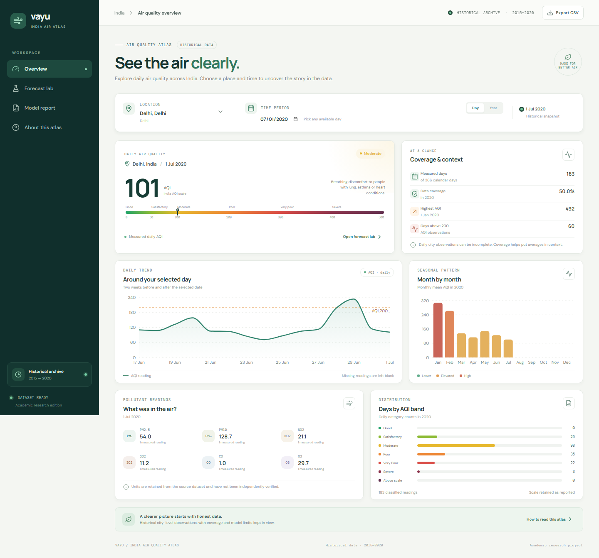

# Vayu — India Air Quality Atlas

Vayu is a college project that pairs an interactive explorer for historical air-quality observations across India with an honest demonstration of a trained next-day AQI model. Choose a city and inspect recorded AQI and pollutant readings by year or date, explore the model's evaluation report, or enter Delhi readings for a one-day-ahead scenario forecast.


<br />[Mobile overview](docs/screenshots/overview-mobile.png) · [Forecast lab](docs/screenshots/forecast-desktop.png) · [Model report](docs/screenshots/model-report-desktop.png)

**The history is not live air-quality data.** The underlying city-day dataset covers 26 cities during 2015–2020, with different date coverage by city and gaps in some measurements. The trained forecasting model is narrower: it predicts next-calendar-day AQI for Delhi only. It cannot produce current readings, other-city forecasts, arbitrary future years, or a multi-day forecast. In the scenario form, the date labels the input day and following-day target; the model uses today's AQI and pollutant values, not the date itself. Missing historical observations remain unavailable; missing forecast pollutants use the saved imputer and are disclosed by the interface.

## Run the dashboard

Requirements: Node.js 20 or newer and npm.

```powershell
npm ci
npm run dev
```

Vite prints the local URL. Create and preview a production build with:

```powershell
npm run build
npm run preview
```

Run the project checks with:

```powershell
npm test
npx playwright install chromium
npm run build
npm run test:e2e
```

The dashboard is a static Vite/React app. Its city histories, compact model export, and fonts are served locally; it does not require a runtime Python service, database, remote font, or paid data API. The repository includes 29,531 derived observations as JSON and the compact browser forest, keeping source gaps as null. It excludes the original raw CSV and Python `joblib` artifact. The JavaScript model export mirrors the fitted Python pipeline: median imputation and missing-value indicators feed the 200-tree random forest, with float32 values used for tree comparisons. The exporter checks parity against held-out and edge-case inputs.

## Reproduce the trained model

The model was trained from the [Air Quality Data in India dataset](https://www.kaggle.com/datasets/rohanrao/air-quality-data-in-india), published by Rohan Rao on Kaggle. Kaggle's dataset metadata API reported [CC0: Public Domain](https://creativecommons.org/publicdomain/zero/1.0/) on 8 October 2026; the [dataset page](https://www.kaggle.com/datasets/rohanrao/air-quality-data-in-india) and [metadata endpoint](https://www.kaggle.com/api/v1/datasets/list?search=air-quality-data-in-india) should be checked again before reuse. Give attribution to the publisher. Pollutant units are retained from the supplied CSV and have not been independently verified. The GitHub repo excludes the raw dataset and fitted Python binary.

Download `city_day.csv` and place it at `data/raw/city_day.csv`. Then, in Windows PowerShell:

```powershell
python -m venv .venv
./.venv/Scripts/python.exe -m pip install -r requirements-lock.txt
./.venv/Scripts/python.exe -m unittest discover -s tests -v
./.venv/Scripts/python.exe -m src.train --data data/raw/city_day.csv --city Delhi
./.venv/Scripts/python.exe -m src.verify_model
./.venv/Scripts/python.exe scripts/export_dashboard.py
```

Linux/macOS users can replace `./.venv/Scripts/python.exe` with `./.venv/bin/python`.

The experiment joins each Delhi day's inputs to AQI on the exact next calendar day. Missing current/next-day AQI rows are excluded; pollutant medians and missingness indicators are fitted within the training pipeline. The data is split chronologically into 1,395 training rows (target dates 2 January 2015–11 November 2018), 299 validation rows (12 November 2018–6 September 2019), and 299 held-out test rows (7 September 2019–1 July 2020). Model selection uses validation MAE; the final test set is evaluated after refitting on training plus validation.

The validation study compares Linear Regression, Random Forest, and Gradient Boosting variants, alongside training-mean and persistence baselines. It also compares AQI-only inputs with AQI-plus-pollutant inputs. The depth-10 Random Forest with five rows per leaf was selected by validation MAE. Feature importance is measured on validation data before the final refit; neither it nor the test report implies pollutant causation.

On that historical test period, the selected **Random Forest depth 10, minimum leaf size 5** had MAE **27.141 AQI points** and RMSE **36.701**. The persistence baseline had MAE **34.498** and RMSE **48.354**, so the model reduced MAE by 21.33% on this test. R² was 0.909; R² measures fit relative to a mean baseline and is **not accuracy percentage**. These results do not establish present-day or other-city performance. Read [reports/RESULTS.md](reports/RESULTS.md) for interpretation, limits, and artifacts.

## Project map

- `src/prepare_data.py` cleans the source table and aligns exact next-day targets.
- `src/train.py` performs temporal model selection, evaluation, plotting, and Python model export.
- `src/predict.py` applies the saved Python pipeline to CSV measurements.
- `src/verify_model.py` checks fresh-process inference and input validation.
- `reports/` contains data audit, split boundaries, measured results, validation comparisons, error summaries, and figures.
- `data/` contains the local raw source and generated processed data and is not committed.
- `public/data/` contains the derived 26-city history, model, evaluation report, and verified prediction parity fixtures used by the browser.
- `scripts/export_dashboard.py` rebuilds those browser data assets from the source CSV and trained pipeline, then checks parity.
- `src/web/` contains the dashboard and its AQI analysis/model inference helpers.
- `docs/DASHBOARD.md` explains the interface, demonstration sequence, local checks, and hosting options.
- `PROJECT_GUIDE.md` documents the project objective, experiment design, and viva preparation.

For the dashboard's supported data, interaction flow, and college demonstration checklist, see [docs/DASHBOARD.md](docs/DASHBOARD.md). The current project demo runs locally with Vite; local hosting is separate from a later public deployment.

## Limitations and responsible interpretation

The historical archive ends in 2020. The model is Delhi-only and one day ahead, and its rolling test assumes the previous day's observation is available. It has no live feed, weather inputs, delayed-publication model, or multi-day recursion. Missing data and severe events can affect reliability. Predictions are not clipped to 0–500; the original data contains AQI values above 500, whose derivation needs source-level interpretation. Do not use this educational project for health or emergency decisions.

The original CSV is not included; the derived browser-ready observations are committed with source provenance in `public/data/manifest.json`. Before re-exporting or redistributing data, preserve publisher attribution and verify current license metadata.

## Development and contribution

Use a feature branch and review changes before merging. Python experiment changes should include the checks in [CONTRIBUTING.md](CONTRIBUTING.md); web changes should run the npm checks and a production build. Keep raw data, virtual environments, local paths, credentials, and generated binary model artifacts out of commits. Report measured changes to the validation protocol and keep the final test period out of model selection.
